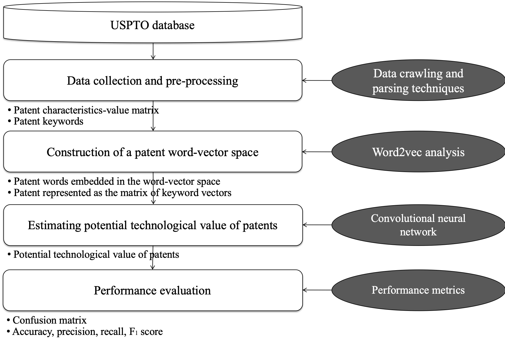

# Estimating-technological-value-of-the-patented-inventions
Research framework and Python implementation of the research 'Estimating technological value of the patented invention'

***

Description
-----------
Python codes to conduct the research "Estimating-technological value of the patented inventions".

Given the data (looks like the one in the folder 'data'), the analysis shown in the research framework is conducted.

The codes consist of following parts.
  1. Data loading and pre-processing
  2. Word2vec analysis on the patented inventions
  3. Convolutional neural network analysis to estimate the value of the patented inventions
  4. Validation using the k-fold cross validation
  

Prerequisites
-------------
1. Python (the codes in this repository are developed using Python verison 3.6.6)
2. You need several external packages, and they are mentioned in the python file.

